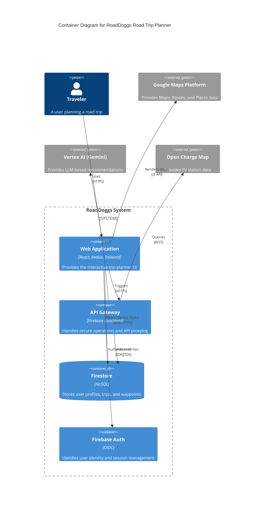
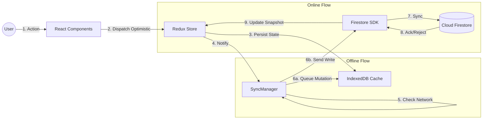
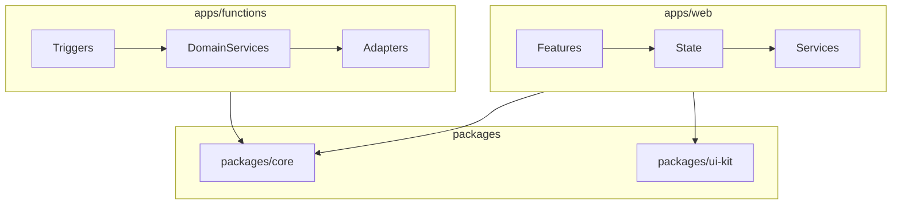
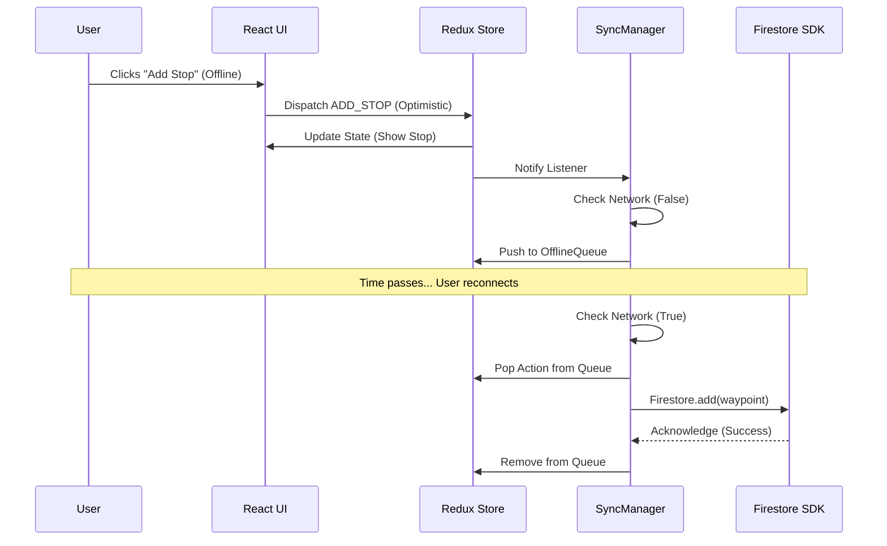
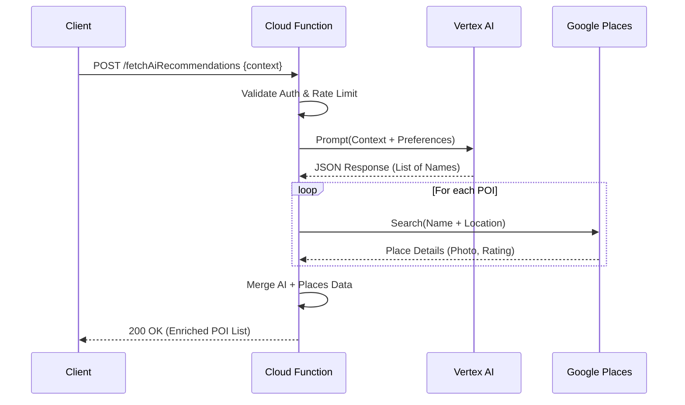

#  RoadDoggs Technical Specification
## [TRD-1] Introduction & Vision
This Technical Requirements Document (TRD) defines the implementation specifications for the RoadDoggs platform, an AI-powered collaborative road trip planning application. It serves as the primary source of truth for the engineering team, covering the frontend application, backend serverless infrastructure, and shared domain logic.

The system is designed as an offline-first Single Page Application (SPA) utilizing a vertical slice architecture. The core technical objective is to deliver a seamless user experience that persists functionality in low-connectivity environments ("Dead Zones") while managing the complexities of real-time state synchronization among multiple travelers.

### [TRD-2] System Boundaries
[TRD-3] Build vs. Buy: 

[TRD-4] We Build: The Trip Planner interface, Route Visualization logic, Collaborative State Sync engine, and AI Prompt Engineering context. 

[TRD-5] We Buy: The Route Calculation engine (Google Maps Directions API), POI Database (Google Places API), and Generative Intelligence (Vertex AI). 

[TRD-6] Primary Interface: A Progressive Web App (PWA) built with React. 

[TRD-7] Backend Model: Backend-as-a-Service (BaaS) using Firebase (Auth, Firestore, Functions) to minimize operational overhead and maximize development velocity. 

### [TRD-8] Definitions & Glossary
[TRD-9] Optimistic UI: A pattern where the client updates the UI immediately upon user interaction, assuming the server request will succeed, and rolls back only if an error occurs. 

[TRD-10] Atomic Batch: A set of database write operations that succeed or fail together; used to ensure data integrity during complex updates (e.g., deleting a trip and all its waypoints). 

[TRD-11] Cold Start: The latency incurred when a cloud function is invoked after a period of inactivity, requiring the provider to provision a new container instance. 

[TRD-12] Fractional Indexing: A technique for ordering list items by assigning them floating-point numbers, allowing insertion between two items without re-indexing the entire list. 

## [TRD-13] Architectural Drivers & Constraints
### [TRD-14] Offline-First Consistency Strategy
The application must prioritize local availability. The persistence layer acts as the primary source of truth for the User Interface, synchronizing with the cloud asynchronously.

[TRD-15] The system must utilize the Firestore Web SDK with enableIndexedDbPersistence() active to cache active document snapshots locally. 

[TRD-16] The UI must render solely from local Redux state which is hydrated from the persistent cache to ensure Time to Interactive (TTI) is independent of network latency. 

[TRD-17] The system must adhere to the following performance constraint for local reads: 

[TRD-18]
```latex
TTI_{local} \leq 100ms
```

[TRD-19] Write operations must utilize Optimistic UI updates. The application must apply changes to the local Redux store immediately while queuing the mutation for background synchronization. 

[TRD-20] The system must maintain an OfflineMutationQueue in the local store to track pending write operations (e.g., ADD_STOP, UPDATE_TITLE). 

[TRD-21] The synchronization logic must retry failed writes with exponential backoff: 

[TRD-22]
```latex
T_{wait} = \min(T_{cap}, T_{base} \cdot 2^n)
```

[TRD-23] where $n$ is the retry count, $T_{base}$ is the initial delay (1s), and $T_{cap}$ is the maximum delay (30s). 

[TRD-24] If a terminal synchronization error occurs (e.g., Permission Denied), the system must trigger a rollback action to revert the local state to the last known server state. 

### [TRD-25] Concurrency & Conflict Resolution
To support collaborative planning without the complexity of Operational Transformation (OT), the system employs a "Last Write Wins" (LWW) strategy for scalar fields and atomic operations for lists.

[TRD-26] For scalar fields (e.g., Trip Title, Description), the system must utilize server-side timestamps. 

[TRD-27] When a write occurs, the condition for acceptance is defined as: 

[TRD-28]
```latex
\text{Accept} \iff t_{write} > t_{current}
```

[TRD-29] where $t_{write}$ is the timestamp of the incoming request and $t_{current}$ is the timestamp of the stored document. 

[TRD-30] For array fields (e.g., Collaborator IDs), the system must utilize arrayUnion and arrayRemove atomic operations provided by Firestore to prevent race conditions during concurrent invites or removals. 

[TRD-31] For ordered lists (e.g., Waypoints), the system must not store them as arrays. Instead, Waypoints must be stored as individual documents within a sub-collection, each containing an orderIndex field. 

[TRD-32] Reordering operations must update only the orderIndex of affected documents using a batch write. 

### [TRD-33] Resource & Cost Constraints
The system relies on metered third-party APIs (Google Maps, Vertex AI). Technical implementation must enforce caching and rate limiting to stay within budget.

[TRD-34] The backend must implement a token bucket rate limiter for AI requests per user: 

[TRD-35]
```latex
R_{allowed} = \min(R_{user}, R_{global})
```

[TRD-36] where $R_{user}$ is the user's remaining quota and $R_{global}$ is the system-wide safety limit. 

[TRD-37] All HTTP-triggered functions must have a configured timeout of 60 seconds. 

[TRD-38] Background triggers (Firestore events) must have a configured timeout of 540 seconds to handle heavy cleanup tasks. 

[TRD-39] The total execution time $T_{exec}$ for any function chain must adhere to: 

[TRD-40]
```latex
T_{exec} \leq T_{limit} - \epsilon
```

[TRD-41] where $T_{limit}$ is the platform timeout and $\epsilon$ is a safety buffer of 5 seconds. 

## [TRD-42] Component & System Diagrams
### [TRD-43] C4 Container Diagram
The following diagram illustrates the high-level interactions between the Client Application, Serverless Backend, and External Services.

[TRD-44]


### [TRD-45] Data Flow Diagram: Synchronization
This diagram depicts the flow of data during an offline write operation and subsequent synchronization.

[TRD-46]


### [TRD-47] Module Dependency Graph
The codebase enforces a strict dependency direction to ensure maintainability and testability.

[TRD-48]


## [TRD-49] Subsystem: Shared Domain ()
This subsystem defines the "Language" of the system. All code in this package must be Isomorphic (running on both Node.js and Browser environments). It must contain zero side effects and no platform-specific dependencies.

### [TRD-50] Type Definitions (TypeScript)
#### [TRD-51] Identity Models
[TRD-52] interface UserProfile: 

[TRD-53] uid (string): Unique identifier. 

[TRD-54] email (string): User email. 

[TRD-55] displayName (string): Public name. 

[TRD-56] photoURL (string): Avatar URL. 

[TRD-57] preferences (UserPreferences): Nested object. 

[TRD-58] interface UserPreferences: 

[TRD-59] nature (boolean): Preference flag. 

[TRD-60] culture (boolean): Preference flag. 

[TRD-61] foodie (boolean): Preference flag. 

[TRD-62] budget (enum): LOW | MID | HIGH. 

[TRD-63] rvProfile (RvProfile | null): Optional vehicle constraints. 

[TRD-64] interface RvProfile: 

[TRD-65] height (number): Meters. 

[TRD-66] weight (number): Kilograms. 

[TRD-67] fuelType (enum): GAS | DIESEL | ELECTRIC. 

#### [TRD-68] Trip Models
[TRD-69] interface TripMetadata: 

[TRD-70] id (string): UUID. 

[TRD-71] ownerId (string): Reference to UserProfile.uid. 

[TRD-72] title (string): User-defined title. 

[TRD-73] collaboratorIds (string[]): UIDs with write access. 

[TRD-74] viewerIds (string[]): UIDs with read access. 

[TRD-75] status (enum): DRAFT | ACTIVE | COMPLETED | ARCHIVED. 

[TRD-76] dates (object): { start: Timestamp, end: Timestamp }. 

[TRD-77] bounds (GeoTuple[]): [[lat, lng], [lat, lng]] (SW, NE). 

[TRD-78] interface Waypoint: 

[TRD-79] id (string): UUID. 

[TRD-80] tripId (string): Foreign key. 

[TRD-81] location (GeoJSON Point): { type: 'Point', coordinates: [lng, lat] }. 

[TRD-82] placeId (string): Google Maps Place ID. 

[TRD-83] type (enum): ORIGIN | DESTINATION | STOP | POI. 

[TRD-84] orderIndex (number): Sorting key. 

[TRD-85] locked (boolean): Optimization flag. 

[TRD-86] notes (string): User annotations. 

#### [TRD-87] Communication Models
[TRD-88] interface ChatMessage: 

[TRD-89] id (string): UUID. 

[TRD-90] senderId (string): UID. 

[TRD-91] content (string): Text body. 

[TRD-92] timestamp (number): Epoch milliseconds. 

[TRD-93] type (enum): USER | SYSTEM. 

[TRD-94] interface SystemLog extends ChatMessage: 

[TRD-95] metadata (object): { action: string, targetId: string }. 

#### [TRD-96] Sync Models
[TRD-97] type SyncActionType: 'ADD_STOP' | 'UPDATE_TRIP' | 'DELETE_STOP' | 'INVITE_USER'. 

[TRD-98] interface SyncAction: 

[TRD-99] id (string): Unique mutation ID. 

[TRD-100] type (SyncActionType): Discriminator. 

[TRD-101] payload (any): The data payload. 

[TRD-102] timestamp (number): Creation time. 

[TRD-103] retryCount (number): For exponential backoff. 

### [TRD-104] Validation Schemas (Zod)
#### [TRD-105] API Payloads
[TRD-106] CreateTripSchema: 

[TRD-107] title: String, min 3, max 100 chars. 

[TRD-108] startDate: Date, must be >= today. 

[TRD-109] endDate: Date, must be >= startDate. 

[TRD-110] InviteUserSchema: 

[TRD-111] email: Valid email format. 

[TRD-112] role: Enum EDITOR | VIEWER. 

[TRD-113] tripId: UUID. 

#### [TRD-114] AI Contracts
[TRD-115] AiPoiResponseSchema: 

[TRD-116] Must define an array of AiRecommendation. 

[TRD-117] AiRecommendation: 

[TRD-118] name: String. 

[TRD-119] description: String. 

[TRD-120] latitude: Number (-90 to 90). 

[TRD-121] longitude: Number (-180 to 180). 

[TRD-122] category: String. 

[TRD-123] reason: String explanation of why it fits the user context. 

### [TRD-124] Domain Logic Engines
#### [TRD-125] Permissions Engine
The Permissions module encapsulates the Access Control Logic (ACL).

[TRD-126] Role Definitions: 

[TRD-127] OWNER: Can delete trip, manage roles, edit all fields. 

[TRD-128] EDITOR: Can edit title, dates, waypoints. Cannot delete trip or manage roles. 

[TRD-129] VIEWER: Read-only access. 

[TRD-130] Verification Matrix: 

[TRD-131] canEdit(user, trip): Returns true if user is OWNER or EDITOR. 

[TRD-132] canDelete(user, trip): Returns true if user is OWNER. 

[TRD-133] canInvite(user, trip): Returns true if user is OWNER. 

#### [TRD-134] GeoMath Utility
[TRD-135]
Formula: Haversine Distance:
The system must calculate the distance $d$ between two points $(\phi_1, \lambda_1)$ and $(\phi_2, \lambda_2)$:

[TRD-136]
```latex
a = \sin^2\left(\frac{\Delta\phi}{2}\right) + \cos \phi_1 \cdot \cos \phi_2 \cdot \sin^2\left(\frac{\Delta\lambda}{2}\right)
```

[TRD-137]
```latex
c = 2 \cdot \text{atan2}(\sqrt{a}, \sqrt{1-a})
```

[TRD-138]
```latex
d = R \cdot c
```

[TRD-139] where $R = 6371$ km. 

[TRD-140]
Algorithm: Bounding Box:
Given a set of waypoints $W$, the system must calculate:

[TRD-141]
```latex
\text{SouthWest} = (\min_{\forall w \in W}(w.lat), \min_{\forall w \in W}(w.lng))
```

[TRD-142]
```latex
\text{NorthEast} = (\max_{\forall w \in W}(w.lat), \max_{\forall w \in W}(w.lng))
```

#### [TRD-143] Fractional Indexing
[TRD-144] The system must implement fractional indexing to insert items without re-indexing. 

[TRD-145] Given two items with indices $i_{prev}$ and $i_{next}$, the new index $i_{new}$ is: 

[TRD-146]
```latex
i_{new} = \frac{i_{prev} + i_{next}}{2}
```

[TRD-147] The system must continue using the (a+b)/2 formula for standard insertions. If the precision delta drops below 1e-6, the system must trigger a batch update to re-index all items in the list to evenly spaced integers. 

## [TRD-148] Subsystem: Frontend Client ()
This subsystem details the React Application architecture, focusing on the Redux state management and the specific logic for key features.

### [TRD-149] Core Infrastructure
#### [TRD-150] Redux Store Configuration
[TRD-151] Root State: 

[TRD-152] auth: AuthSlice 

[TRD-153] trip: TripSlice 

[TRD-154] waypoints: EntityState<Waypoint> 

[TRD-155] ui: UiSlice 

[TRD-156] offline: OfflineSlice 

[TRD-157] Middleware: 

[TRD-158] serializable-state-invariant-middleware: Must be configured to ignore Firebase Timestamp objects in specific paths. 

[TRD-159] action-listener-middleware: Used to trigger side effects (like Sync) based on specific actions. 

[TRD-160] Persistence: 

[TRD-161] redux-persist must be configured with localForage (IndexedDB wrapper) as the storage engine. 

[TRD-162] The offline slice must be whitelisted to survive browser restarts. 

#### [TRD-163] Sync Manager (The Heart)
[TRD-164] Responsibility: Orchestrates data flow between Redux, LocalStorage, and Firestore. 

[TRD-165] State Machine: 

[TRD-166] IDLE: Connected, no pending writes. 

[TRD-167] OFFLINE: Network disconnected. 

[TRD-168] PENDING_WRITES: Offline with items in the queue. 

[TRD-169] SYNCING: Replaying queue to server. 

[TRD-170] ERROR: Sync failed, awaiting retry. 

[TRD-171] Logic: 

[TRD-172] On window.offline: Dispatch networkStatusChanged(false). 

[TRD-173] On window.online: Dispatch networkStatusChanged(true) and trigger processMutationQueue. 

[TRD-174] On action.meta.sync === true: 

[TRD-175] If IDLE: Send directly to Firestore SDK. 

[TRD-176] If OFFLINE or SYNCING: Serialize action and push to offline.queue. 

### [TRD-177] Module: Trip Planner
#### [TRD-178] Component: MapController (Wrapper)
[TRD-179] Inputs: waypoint[], routePolyline (encoded string). 

[TRD-180] Logic: 

[TRD-181] Debouncing: The component must debounce onBoundsChanged events by 500ms before dispatching updates to Redux to avoid excessive re-renders. 

[TRD-182] Optimistic Drag: On markerDragEnd, the component must immediately calculate the new lat/lng and dispatch the Redux action. It must NOT wait for the Google Maps "snap to road" service during the drag operation. 

[TRD-183] Caching: Directions Service responses must be cached in sessionStorage using a key derived from origin_id + dest_id + waypoints_hash. 

[TRD-184] Internal State: 

[TRD-185] hoveredWaypointId: string | null. 

[TRD-186] cameraState: { center, zoom }. 

#### [TRD-187] Component: ItineraryTimeline
[TRD-188] Virtualization: 

[TRD-189] The component must implement react-window if the number of waypoints exceeds 50. 

[TRD-190] Each row must have a fixed height of 64px to simplify offset calculations. 

[TRD-191] Drag Logic: 

[TRD-192] The component must integrate dnd-kit for vertical list reordering. 

[TRD-193] On dragEnd, the component must identify the over element and calculate the new orderIndex using the fractional indexing logic from packages/core. 

### [TRD-194] Module: Discovery
#### [TRD-195] Component: PoiSearch
[TRD-196] Protocol: 

[TRD-197] The component must utilize the useMapsLibrary('places') hook. 

[TRD-198] It must generate a AutocompleteSessionToken upon component mount. 

[TRD-199] It must pass this token to every getPlacePredictions call. 

[TRD-200] It must pass the same token to the getDetails call when a user selects a result. 

[TRD-201] It must regenerate the token after a selection is made. 

[TRD-202] This ensures Google bills the interaction as a single "Autocomplete Session" rather than separate requests. 

#### [TRD-203] Component: AiDrawer
[TRD-204] State: 

[TRD-205] status: idle | loading | success | error. 

[TRD-206] recommendations: AiRecommendation[]. 

[TRD-207] Action: 

[TRD-208] When the user clicks "Generate", the component must dispatch a fetchAiRecommendations async thunk. 

[TRD-209] This thunk must call the Cloud Function, not the Vertex AI API directly. 

[TRD-210] UI: 

[TRD-211] While status === 'loading', the component must render 3 skeleton cards with a shimmer effect. 

### [TRD-212] Module: Collaboration
#### [TRD-213] Component: UserPresence
[TRD-214] Logic: 

[TRD-215] The component must subscribe to the trips/{tripId} document snapshot. 

[TRD-216] It must extract the lastActive map: { [uid]: timestamp }. 

[TRD-217] It must filter for users where: 

[TRD-218]
```latex
CurrentTime - UserTimestamp < 300000 \text{ (5 minutes)}
```

[TRD-219] UI: 

[TRD-220] Active users are shown with a green dot. 

[TRD-221] Inactive users (collaborators on the trip but not present) are shown faded. 

[TRD-222] Avatars must stack horizontally with a max of 5 visible (+N overflow). 

## [TRD-223] Subsystem: Backend Services ()
This subsystem executes trusted business logic in a serverless environment. It isolates API keys and performs validation that cannot be trusted to the client.

### [TRD-224] Trigger Handlers
#### [TRD-225] HttpTriggers
[TRD-226] generateShareLink: 

[TRD-227] Input: { tripId: string, role: 'EDITOR' | 'VIEWER' }. 

[TRD-228] Auth: Must verify context.auth exists. 

[TRD-229] Validation: Must verify user is OWNER of tripId. 

[TRD-230] Action: Calls TripService.generateToken. 

[TRD-231] Output: { url: string, expiry: timestamp }. 

[TRD-232] exportPdf: 

[TRD-233] Input: { tripId: string }. 

[TRD-234] Validation: Must verify user has read access. 

[TRD-235] Action: Calls DocumentGenerator.createPdf. 

[TRD-236] Output: { downloadUrl: string } (Signed GCS URL). 

#### [TRD-237] DbTriggers
[TRD-238] onTripDelete: 

[TRD-239] Trigger: document('trips/{tripId}').onDelete. 

[TRD-240] Responsibility: Recursive deletion strategy. 

[TRD-241] Logic: 

[TRD-242] Query trips/{tripId}/waypoints. 

[TRD-243] Create a WriteBatch. 

[TRD-244] Iterate and add delete operations to batch. 

[TRD-245] Commit batch. 

[TRD-246] Repeat for chat and expenses sub-collections. 

[TRD-247] Note: Firestore batches are limited to 500 ops. Logic must handle pagination if > 500 documents exist. 

### [TRD-248] Service Layer (Business Logic)
#### [TRD-249] TripService
[TRD-250] Algorithm: Token Generation: 

[TRD-251] The service must generate a random token using crypto.randomBytes(32).toString('hex'). 

[TRD-252] It must hash this token using SHA-256 before storing it in the database. 

[TRD-253] The raw token is returned to the user; the hash is stored. 

[TRD-254] Verification: 

[TRD-255] A CLI command npm run cli -- invite:mock must be implemented to test this flow locally. 

#### [TRD-256] IntelligenceService (AI Proxy)
[TRD-257] Prompt Engineering: 

[TRD-258] The System Prompt must be strictly defined: 

[TRD-259] ""You are a travel assistant. You must output valid JSON array matching this schema: [ { name, description, lat, lng, category, reason } ]. Do not include Markdown formatting. Do not include preamble."" 

[TRD-260] The service must inject the User's Preference JSON string into the prompt context. 

[TRD-261] Error Handling: 

[TRD-262] If Vertex AI returns a 500 error, the service must retry once. 

[TRD-263] If the output JSON is malformed, the service must attempt to repair it using a JSON repair library (e.g., jsonrepair). 

[TRD-264] If repair fails, it returns a 422 error to the client. 

#### [TRD-265] Adapter Layer
[TRD-266] MapsAdapter: 

[TRD-267] Encapsulates axios calls to https://maps.googleapis.com. 

[TRD-268] Injects key=${process.env.GOOGLE_MAPS_SERVER_KEY}. 

[TRD-269] Implements retry logic for 429 (Rate Limit) errors. 

[TRD-270] StorageAdapter: 

[TRD-271] Uses admin.storage().bucket(). 

[TRD-272] Generates V4 Signed URLs with a 15-minute expiration for file downloads. 

## [TRD-273] Protocols & Sequences
### [TRD-274] Protocol: Offline Write & Sync
This sequence describes how a user adds a stop while offline and how it syncs later.

[TRD-275]


### [TRD-276] Protocol: AI Recommendation
This sequence describes the secure proxying of AI requests.

[TRD-277]


## [TRD-278] Data Architecture & Persistence
### [TRD-279] Firestore Schema (NoSQL)
#### [TRD-280] Collection:
[TRD-281] Document ID: uid (from Auth). 

[TRD-282] Fields: 

[TRD-283] email: string. 

[TRD-284] preferences: map. 

[TRD-285] createdAt: timestamp. 

[TRD-286] Indexes: 

[TRD-287] Composite: email ASC. 

#### [TRD-288] Collection:
[TRD-289] Document ID: UUID. 

[TRD-290] Fields: 

[TRD-291] ownerId: string. 

[TRD-292] collaboratorIds: array<string>. 

[TRD-293] viewerIds: array<string>. 

[TRD-294] title: string. 

[TRD-295] dates: map {start, end}. 

[TRD-296] updatedAt: timestamp (for LWW). 

[TRD-297] Indexes: 

[TRD-298] Array-Contains: collaboratorIds. 

[TRD-299] Composite: ownerId ASC, updatedAt DESC (For "My Trips" dashboard). 

#### [TRD-300] Sub-collection:
[TRD-301] Document ID: UUID. 

[TRD-302] Fields: 

[TRD-303] location: geo_point. 

[TRD-304] placeId: string. 

[TRD-305] type: string. 

[TRD-306] orderIndex: number. 

[TRD-307] Indexes: 

[TRD-308] Collection-Group: None required for MVP. 

[TRD-309] Single Field: orderIndex ASC (For fetching route order). 

### [TRD-310] Security Rules ()
#### [TRD-311] RBAC Implementation
[TRD-312]
```javascript
function isOwner(resource) {
  return request.auth.uid == resource.data.ownerId;
}

function canEdit(resource) {
  return isOwner(resource) || 
         resource.data.collaboratorIds.hasAny([request.auth.uid]);
}
```

#### [TRD-313] Data Validation Rules
[TRD-314]
```javascript
match /trips/{tripId} {
  allow update: if canEdit(resource) && 
                request.resource.data.title.size() > 3;
}

match /trips/{tripId}/waypoints/{wpId} {
  allow write: if canEdit(get(/databases/$(database)/documents/trips/$(tripId)));
}
```

## [TRD-315] Verification Strategy
### [TRD-316] Developer Tooling
[TRD-317] CLI Specification: 

[TRD-318] scripts/cli.ts must be implemented using ts-node. 

[TRD-319] Command: trip:create <title> - creates a trip in the Emulator. 

[TRD-320] Command: ai:test <prompt> - sends a request to the locally running Function emulator which calls the real Vertex API (if configured) or a mock. 

[TRD-321] Emulator Configuration: 

[TRD-322] firebase.json must expose: 

[TRD-323] Auth: 9099 

[TRD-324] Firestore: 8080 

[TRD-325] Functions: 5001 

[TRD-326] The web app must connect to these ports when NODE_ENV=development. 

### [TRD-327] Test Plans
#### [TRD-328] Unit Tests (Jest)
[TRD-329] Target: packages/core (Domain Logic). 

[TRD-330] Scope: 

[TRD-331] Validate CostCalculator handles 0 travelers gracefully (divide by zero check). 

[TRD-332] Validate GeoMath returns correct distances for known coordinate pairs. 

[TRD-333] Validate Permissions matrix returns correct booleans for all role combinations. 

[TRD-334] Requirement: CI fails if coverage < 80%. 

#### [TRD-335] Integration Tests (Live Canary)
[TRD-336] Target: External APIs. 

[TRD-337] Frequency: Runs daily via GitHub Actions Schedule. 

[TRD-338] Logic: 

[TRD-339] Sends a "Hello World" prompt to Vertex AI. 

[TRD-340] Asserts response is 200 OK. 

[TRD-341] Goal: Detect if Google changes API signatures or if Billing is disabled. 

#### [TRD-342] Manual Verification Checklist
[TRD-343] [ ] Offline Mode: 

[TRD-344] Open app -> Load Trip -> Turn off WiFi -> Add Stop -> Reload Page -> Turn on WiFi. 

[TRD-345] Pass Criteria: Stop appears on map after reload and syncs to server. 

[TRD-346] [ ] Concurrent Edit: 

[TRD-347] Open Trip in Tab A and Tab B (Simulating 2 users). 

[TRD-348] Edit Title in Tab A. 

[TRD-349] Pass Criteria: Tab B updates automatically within 2 seconds. 

## [TRD-350] Deployment Requirements
### [TRD-351] CI/CD Pipeline
[TRD-352] Provider: GitHub Actions. 

[TRD-353] Workflow Steps: 

[TRD-354] Checkout Code. 

[TRD-355] Install Dependencies: npm ci. 

[TRD-356] Lint: npm run lint. 

[TRD-357] Test: npm run test. 

[TRD-358] Build: npm run build (Outputs to dist/). 

[TRD-359] Deploy (Main Branch): firebase deploy --token $FIREBASE_TOKEN. 

### [TRD-360] Environment Variables
The following variables must be defined in the CI environment and .env files:

[TRD-361] Public (Build Time): 

[TRD-362] REACT_APP_FIREBASE_API_KEY 

[TRD-363] REACT_APP_AUTH_DOMAIN 

[TRD-364] REACT_APP_PROJECT_ID 

[TRD-365] REACT_APP_GOOGLE_MAPS_KEY (Restricted by HTTP Referrer) 

[TRD-366] Secret (Runtime/Functions): 

[TRD-367] VERTEX_AI_PROJECT_ID 

[TRD-368] VERTEX_AI_LOCATION 

[TRD-369] OPEN_CHARGE_MAP_API_KEY 

### [TRD-370] Monitoring & Observability
[TRD-371] Sentry: 

[TRD-372] DSN must be injected at build time. 

[TRD-373] Source maps must be uploaded during the build process to enable readable stack traces. 

[TRD-374] Firebase Performance: 

[TRD-375] trace('route_calculation_time'): Custom trace must be implemented in MapController to measure time from waypoints_changed to polyline_rendered. 
